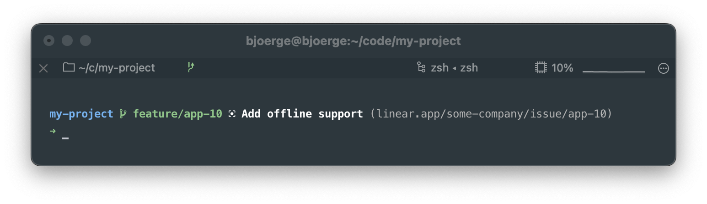

🚀 spaceship-linear
----

[Spaceship prompt](https://spaceship-prompt.sh/) section that shows the title of any issue associated with the current
branch



## Installing

### Add Linear API key

Get your API key from [here](https://linear.app/settings/api), and add this line to your `.zprofile`, `.bash_profile`
etc.

```bash
export SPACESHIP_LINEAR_API_KEY="lin_api_****************************************"
```

### Configure shell

You need to source this plugin somewhere in your dotfiles. Here's how to do it with some popular tools:

### [Oh-My-Zsh]

Execute this command to clone this repo into Oh-My-Zsh plugin's folder:

```zsh
git clone https://github.com/bjoerge/spaceship-linear.git $ZSH_CUSTOM/plugins/spaceship-linear
```

Include `spaceship-linear` in Oh-My-Zsh plugins list:

```zsh
plugins=($plugins spaceship-linear)
```

### [zplug]

```zsh
zplug "bjoerge/spaceship-linear"
```

### [antigen]

```zsh
antigen bundle "bjoerge/spaceship-linear"
```

### [antibody]

```zsh
antibody bundle "bjoerge/spaceship-linear"
```

### [zinit]

```zsh
zinit light "bjoerge/spaceship-linear"
```

### [zgen]

```zsh
zgen load "bjoerge/spaceship-linear"
```

### [sheldon]

```toml
[plugins.spaceship-linear]
github = "bjoerge/spaceship-linear"
```

### Manual

If none of the above methods works for you, you can install Spaceship manually.

1. Clone this repo somewhere, for example to `$HOME/.zsh/spaceship-linear`.
2. Source this section in your `~/.zshrc`.

### Example

```zsh
mkdir -p "$HOME/.zsh"
git clone --depth=1 https://github.com/bjoerge/spaceship-linear.git "$HOME/.zsh/spaceship-linear"
```

For initializing prompt system add this to your `.zshrc`:

```zsh title=".zshrc"
source "~/.zsh/spaceship-linear/spaceship-linear.plugin.zsh"
```

## Usage

After installing, add the following line to your `.zshrc` in order to include the Linear section in the prompt:

```zsh
spaceship add linear
```

## Options

This section is shown only in directories where the working git branch matches a Linear ticket ID

| Variable                             |              Default               | Meaning                                                                                                                                                                                                                                                                                             |
|:-------------------------------------|:----------------------------------:|-----------------------------------------------------------------------------------------------------------------------------------------------------------------------------------------------------------------------------------------------------------------------------------------------------|
| `SPACESHIP_LINEAR_SHOW`              |               `true`               | Show the Linear section                                                                                                                                                                                                                                                                             |
| `SPACESHIP_LINEAR_LINK`              |               `true`               | Set to `true` to display link next to issue title or set to `false` to not show link at all. Alternatively, set to `text` to turn the issue title into a link using [OSC 8 hyperlinks](https://gist.github.com/egmontkob/eb114294efbcd5adb1944c9f3cb5feda) (note: this may cause rendering issues). |
| `SPACESHIP_LINEAR_ASYNC`             |               `true`               | Render section asynchronously                                                                                                                                                                                                                                                                       |
| `SPACESHIP_LINEAR_PREFIX`            | `$SPACESHIP_PROMPT_DEFAULT_PREFIX` | Prefix before section                                                                                                                                                                                                                                                                               |
| `SPACESHIP_LINEAR_SUFFIX`            | `$SPACESHIP_PROMPT_DEFAULT_SUFFIX` | Suffix after section                                                                                                                                                                                                                                                                                |
| `SPACESHIP_LINEAR_SYMBOL`            |                `󰻿`                | Symbol displayed before the section (requires [nerd fonts](https://www.nerdfonts.com/))                                                                                                                                                                                                             |
| `SPACESHIP_LINEAR_COLOR`             |              `white`               | Color of section                                                                                                                                                                                                                                                                                    |
| `SPACESHIP_LINEAR_TITLE_MAX_LENGTH`  |                `35`                | Max length of issue title. Longer titles will be truncated                                                                                                                                                                                                                                          |
| `SPACESHIP_LINEAR_CACHE_DIR`         |      `/tmp/.spaceship-linear`      | Which directory to cache ticket info in                                                                                                                                                                                                                                                             |
| `SPACESHIP_LINEAR_CACHE_TTL_SECONDS` |               `300`                | How long (in seconds) to cache ticket info for before re-fetching from the linear API                                                                                                                                                                                                               |

## Credits

This plugin is riffing off of the initial idea and great work by [Rostislav Melkumyan](https://github.com/RostiMelk) in
the [linear-branch-matcher](https://github.com/RostiMelk/linear-branch-matcher) project

## License

MIT © [Bjørge Næss](https://github.com/bjoerge/)

<!-- References -->

[Oh-My-Zsh]: https://ohmyz.sh/

[zplug]: https://github.com/zplug/zplug

[antigen]: https://antigen.sharats.me/

[antibody]: https://getantibody.github.io/

[zinit]: https://github.com/zdharma/zinit

[zgen]: https://github.com/tarjoilija/zgen

[sheldon]: https://sheldon.cli.rs/
